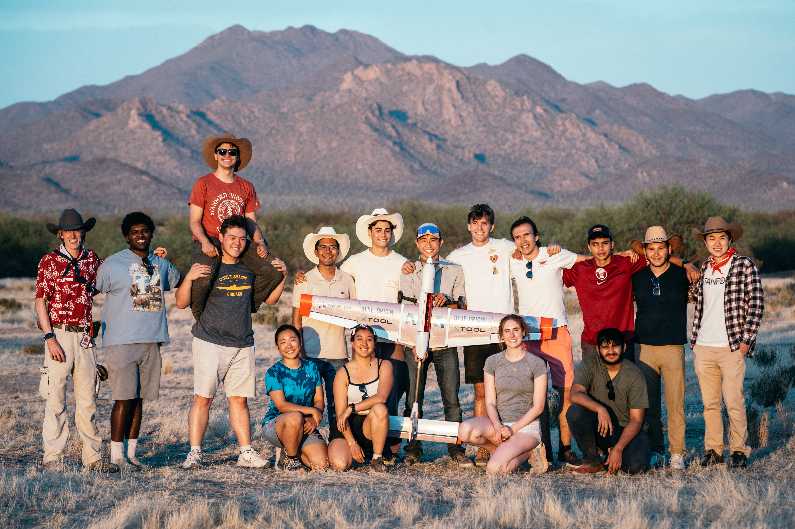
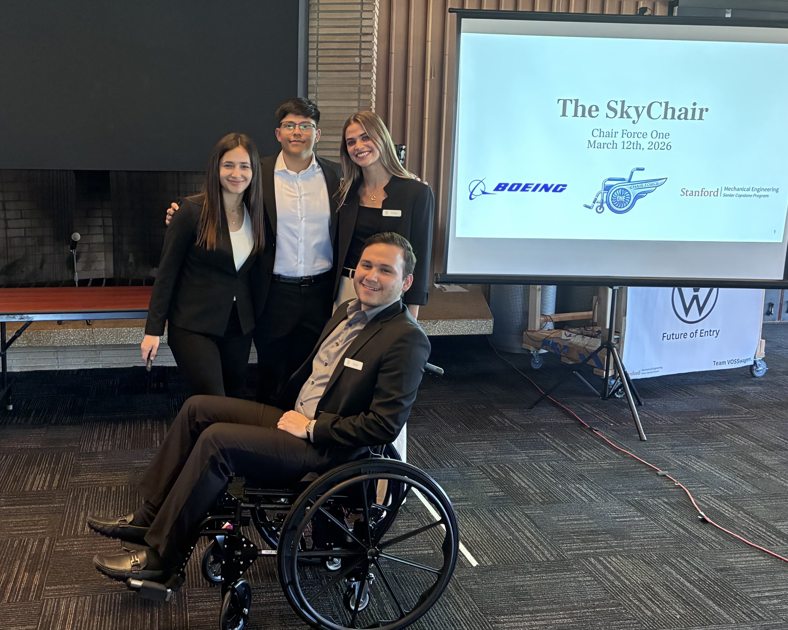

# Portfolio
## [Resume](https://drive.google.com/file/d/1cDfSkI44ZAzvjiXbxKK9JYaN-akUX4o0/view?usp=sharing)
## Projects

### Stanford AIAA Design/Build/Fly ([Details](dbf))
- Description of the comp
- Roles Served
  - Structures Lead (Oct 2024 - April 2025)
  - Team Captain & Project Manager (Oct 2023 - April 2024)
- Performance
  - 2023: 21/99
  - 2024: 33/107
  - 2025: 67/112

### The SkyChair ([Details](skychair))
- ME170 Senior Capstone Project
- [Project Report](https://doi.org/10.25740/tb591rk8388)

# Education
- Stanford University - MS in Aeronautics/Astronautics
  - Expected June 2027
  - GPA: 3.95/4.30
- Stanford University - BS in Mechanical Engineering
  - June 2026
  - GPA: 4.09/4.30

# Work History
- Structures Engineering Intern - Radia, Inc.
  - June 2026 - Present (Boulder, CO)
- Mechanical Systems Engineering Intern - Radia, Inc. 
  - June 2025 - Sept 2025 (Boulder, CO)
- Aerospace Engineering Intern - Sabrewing Aircraft Co. 
  - June 2024 - Sept 2024 (Hayward, CA)
- Materials Engineering Intern - The Port Authority of NY & NJ
  - June 2023 - Aug 2023 (Jersey City, NJ)
- Civil Engineering Intern - Pennoni, Inc.
  - March 2022 - June 2022 (Newark, NJ)

# Skills & Coursework
## Technical Skills
### CAD
- CATIA V5/V6, Fusion 360, SOLIDWORKS

### Analysis & Simulation
- HyperWorks, HyperMesh, OptiStruct, MSC Nastran, HyperSizer, HyperX, SimLab

### Fabrication
- 3D Printing, CNC Routing, Manual Mill, Sheet Metal Forming, Power Tools, Laser Cutting

### Programming & Tools
- Python, MATLAB, iNav, Microsoft Office, Jira

## Coursework
- Analysis of Structures
- Mechanics of Composite Materials
- Mechanical Systems Design
- Advanced Dynamics & Computation
- Dynamic Systems, Vibrations & Control
- Control Design Techniques
- Computational Engineering
- Optimal & Learning-Based Control
- Advanced Feedback Control Design
- Flight Mechanics & Controls
- Applied Aerodynamics
- Intermediate Fluid Mechanics
- Intermediate Thermodynamics
- Heat Transfer
